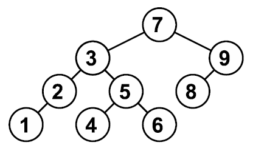

# [A. Высота дерева](https://informatics.mccme.ru/mod/statements/view.php?id=599#1)
Реализуйте бинарное дерево поиска для целых чисел. Программа получает на вход последовательность целых чисел и строит из них дерево. Элементы в деревья добавляются в соответствии с результатом поиска их места. Если элемент уже существует в дереве, добавлять его не надо. Балансировка дерева не производится.

### Входные данные
На вход программа получает последовательность натуральных чисел. Последовательность завершается числом $0$, которое означает конец ввода, и добавлять его в дерево не надо.

### Выходные данные
Выведите единственное число – высоту получившегося дерева.

Пример соответствует следующему дереву:

### Примеры
```
входные данные
7 3 2 1 9 5 4 6 8 0
```
```
выходные данные
4
```

# [B. Количество элементов](https://informatics.mccme.ru/mod/statements/view.php?id=599&chapterid=758#1)
Подсчитайте количество элементов в получившемся дереве и выведите это количество.

### Входные данные
Вводится последовательность целых чисел, оканчивающаяся нулем. Сам ноль в последовательность не входит.

### Выходные данные
Выведите ответ на задачу.
```
Примеры
входные данные
7 3 2 1 9 5 4 6 8 0
```
```
выходные данные
9
```

# [C. Второй максимум](https://informatics.mccme.ru/mod/statements/view.php?id=599&chapterid=759#1)
Выведите второй по величине элемент в построенном дереве. Гарантируется, что такой найдется.

### Входные данные
Дана последовательность целых чисел, оканчивающаяся нулем. Сам ноль в последовательность не входит.

### Выходные данные
Выведите ответ на задачу.
### Примеры
```
входные данные
7 3 2 1 9 5 4 6 8 0
```
```
выходные данные
8
```

# [D. Обход](https://informatics.mccme.ru/mod/statements/view.php?id=599&chapterid=760)
Выведите все элементы полученного дерева в порядке возрастания.
### Входные данные
Вводится последовательность целых чисел, оканчивающаяся нулем. Сам ноль в последовательность не входит. По данной последовательности требуется построить дерево.
### Выходные данные
Выведите ответ на задачу.
### Примеры
```
входные данные
7 3 2 1 9 5 4 6 8 0
```
```
выходные данные
1
2
3
4
5
6
7
8
9
```

# [E. Вывод листьев](https://informatics.mccme.ru/mod/statements/view.php?id=599&chapterid=761#1)
Для полученного дерева выведите список всех листьев (вершин, не имеющих потомков) в порядке возрастания.

### Входные данные
Вводится последовательность целых чисел, оканчивающаяся нулем. Сам ноль в последовательность не входит.

### Выходные данные
Выведите ответ на задачу.

### Примеры
```
входные данные
7 3 2 1 9 5 4 6 8 0
```
```
выходные данные
1
4
6
8
```

# [F. Вывод развилок](https://informatics.mccme.ru/mod/statements/view.php?id=599&chapterid=762#1)
Для полученного дерева выведите список всех вершин, имеющих по два ребёнка, в порядке возрастания.
### Входные данные
Вводится последовательность целых чисел, оканчивающаяся нулем. Сам ноль в последовательность не входит. Постройте по этой последовательности дерево.
### Выходные данные
Выведите ответ задачи.
### Примеры
```
входные данные
7 3 2 1 9 5 4 6 8 0
```
```
выходные данные
3
5
7
```

# [G. Вывод веток](https://informatics.mccme.ru/mod/statements/view.php?id=599&chapterid=763#1)
Для полученного дерева выведите список всех вершин, имеющих только одного ребёнка, в порядке возрастания.
### Входные данные
Вводится последовательность целых чисел,оканчивающаяся нулем. Построить по ней дерево.
### Выходные данные
Выведите список требуемых вершин.
### Примеры
```
входные данные
7 3 2 1 9 5 4 6 8 0
```
```
выходные данные
2
9
```

# [H. Сбалансированность](https://informatics.mccme.ru/mod/statements/view.php?id=599&chapterid=764)
Дерево называется *сбалансированным*, если для любой его вершины высота левого и правого поддерева для этой вершины различаются не более чем на $1$.

### Входные данные
Вводится последовательность целых чисел, оканчивающаяся нулем. Сам ноль в последовательность не входит. Постройте дерево, соответствующее данной последовательности.
### Выходные данные
Определите, является ли дерево сбалансированным, выведите слово `YES` или `NO`.
### Примеры
```
входные данные
7 3 2 1 9 5 4 6 8 0
```
```
выходные данные
YES
```
